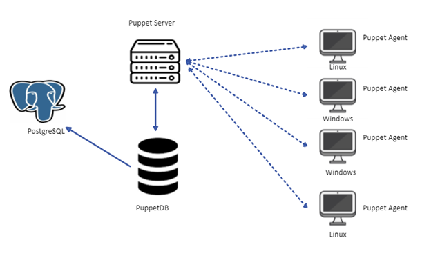

### Puppet setup

Puppet is a configuration management tool that is also used to deploy and configure software on machines. It allows continuous monitoring to ensure the desired state is applied.

The basic architecture is composed of a puppet server running on a linux virtual machine and one or more nodes (i.e. the virtual machines) running puppet agents on which software will be installed and config changes will be applied using Puppet.

The puppet server virtual machine will need to have git installed, r10k and have gitlab runner installed and registered. [install_puppet_server.tpl](../puppet/scripts/linux/install_puppet_server.tpl)

To give access for r10k to the gitlab repo we first need to setup an ssh key and add it to the gitlab settings. This step is still manual for now.

Puppet code is written to define the software and config requirements for all machines. Puppet agents will sync with the puppet server every 30 mins to fetch the latest code and apply the requested changes. The puppet code will live in a gitlab repo that is synced with the puppet server machine. R10k is a code management tool that will allow the puppet server to deploy the latest puppet code from gitlab on every change that is merged. 

Puppet has a puppetDB service that will have PostgreSQL as backend to store the information of all infrastructure components (nodes,resources, relationships and facts).

## This Repo 

In this repo we use Terraform to first create the vNet in which the puppet server and agents machines will live. Then under **puppet_server** we create a linux virtual machine and use custom_data to run a [script](puppet_server/scripts/linux/install_puppet_server.tpl) that will install puppet, start puppetserver service, configure r10k and gitlabrunner. In **puppet_agent** we create a linux VM on which we install and congiure puppet to point to the server machine.
